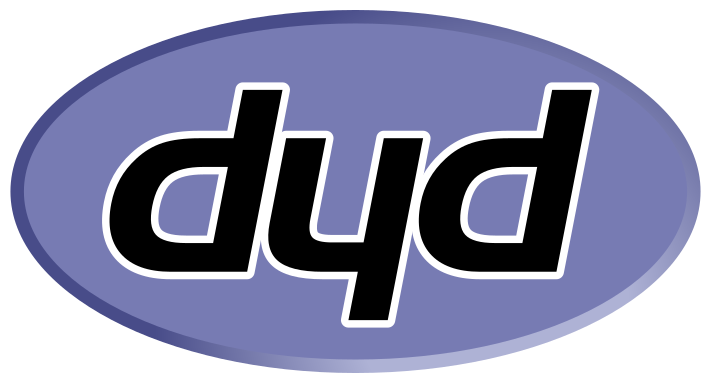

# dyd-logos

Logos for dūds. 

Here is the collection of all official dyd logos, small and large, but all great!

Previously derived from the official PHP logo by Colin Viebrock. 

Explanation incoming…

  

CC BY-SA 4.0

  

*You look like a dūd. Hey, dūd!*
 

*—— Yeah, right! – so what's a dūd? Let's look it up … in a <ins>dictionary</ins>!*
> – Something that doesn't work the way it's supposed to is a <ins>dūd</ins>.
>
> – Also, a <ins>dūd</ins> is a person with a record of failing; someone who loses consistently.[^1]
> 
> – Rarely, all of humanity *– widely disregarded by most, but confirmed by angry dudes all the time*.

[^1]: link: https://vocabulary.com/dictionary/dud. Accessed 07.08.2025.

*Dūds? That's us, right??? Yeah, no frack, that's a real dūd here too – this means you, yes; it's you too!*

 

*<ins>Mathematically</ins>, it's also beautiful. Dūds are defined by:*

1. $`dud + ꣐ = dyd - dūd + dud \qquad`$ [base]

«A dud is nothing until you count on him.»
 
2. $`dud + ⏽ = dyd = dūd \qquad`$ [existence]

«Where's one, there's another?»
 
3. $`dud + ॥ = dyd + dūd \qquad `$ [negative induction, new creation]

«Positive! create anything out of nothing.»

*See… you can count on duds! In fact, you can count on all of them! QED*

 

*And most importantly, last but not least – <ins>etymologically</ins>:*
> dyd is an acronym that stands for: *tools from **dū**ds for **d**ūds* … that's right.

 

___

 

*I have now explained to you in detail and conclusively why dūds are all great.*

*Thank you for your attention to this matter!*
